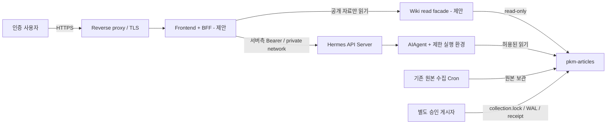

# 아키텍처: Wiki, 웹 서비스, Hermes의 책임 분리

> 상태: 기존 저장소·Hermes 계약에 근거한 설계안. 웹 서비스는 미구현.
> [목차](README.md) · [워크플로](workflows.md) · [근거](evidence.md)

## 1. 시스템 목표와 경계

사용자는 브라우저에서 논문 목록을 찾고, 기존 지식 페이지를 읽고, 출처와 검토 상태를 확인한다. Hermes 질의는 선택 기능이다. 목록 조회마다 LLM을 실행하거나 Wiki 전체를 프롬프트에 넣지 않는다.

외부 frontend는 다른 서버에서 제공할 수 있다. 여기서 **외부**는 UI의 배치 위치를 의미하며, Wiki 전체 또는 도구 실행 권한을 인터넷에 공개한다는 뜻이 아니다. 기본 대상은 소유자 한 명의 인증된 서비스다.

| 계층 | 책임 | 책임이 아닌 것 |
| --- | --- | --- |
| Browser UI | 탐색·렌더링·출처 표시·사용자 의사 입력 | Gateway 비밀키 보관, 임의 로컬 파일 접근 |
| BFF | 사용자 인증, 객체 소유권, 공개 자료 projection, API 제한 | 프롬프트만으로 도구 접근 격리 |
| Hermes API Server | HTTP/SSE, 인증된 요청의 에이전트 실행·상태 | Wiki 전용 CRUD·게시 정책의 자동 구현 |
| AIAgent와 도구 | 허용된 자료 읽기·질의 응답 | 문서만으로 부여되지 않은 컴파일/게시 권한 |
| Wiki | 불변 원본·지식 Markdown·운영 상태의 정식 저장소 | static 웹 document root |
| 수집 Cron | 승인 검색 범위의 원본 저장 | 자동 요약·컴파일·frontend 배포 |
| 승인된 게시 경로 | 정책·해시·잠금·journal·receipt 검증 | 일반 채팅의 임의 write_file |

## 2. 컨테이너/서비스 관점

도형이 있다고 서비스가 설치된 것은 아니다. 현재 실물이 확인된 것은 Wiki와 로컬 Hermes 소스이며, BFF/read facade/frontend는 신규 구현 대상이다. 다이어그램의 제한 실행 환경도 아직 배포·검증하지 않았다.

## 3. 세 종류의 데이터 흐름

### A. 정형 읽기 — 모델 호출 없음

1. BFF가 허용된 컬렉션과 지식 페이지 목록을 읽는다.
2. 원본 `source.json`에서는 공개 허용 서지 필드만 선택한다.
3. 지식 페이지는 committed 상태·revision/hash와 연결 가능한 경우에만 현재 snapshot으로 제공한다.
4. UI는 Markdown, 검토 상태, 실제 읽은 범위, 출처 링크를 표시한다.

이 경로가 초기 MVP다. 검색은 우선 승인된 지식 Markdown의 제목·summary·태그 중심이다. 원문 PDF 추출이나 HTML 사전 청킹을 검색 기능이라는 이름으로 추가하지 않는다.

### B. 에이전트 질의 — 실행 승인을 거친 뒤

BFF는 신뢰할 수 없는 사용자의 request body 전체를 Hermes에 전달하지 않는다. 소유자가 허용한 입력과 서버가 선택한 session/model/자료 범위만 보낸다. 상세히 제어할 custom UI에는 Runs API, 범용 OpenAI 클라이언트에는 Chat Completions를 검토한다.

`cwd`나 system prompt는 보안 경계가 아니다. 파일·terminal·MCP·브라우저·외부 전송 권한은 실행 환경과 서버측 정책으로 제한해야 한다. 기존 default 프로필을 그대로 인터넷 질의 backend로 재사용하는 안은 운영 준비 완료로 취급하지 않는다.

### C. Wiki 생성·게시 — 별도 제어 경로

자유 질의의 완료는 `entities/` 갱신 승인이 아니다. 원문 HTML 또는 v3에서 별도 승인된 로컬 PDF 내장 텍스트 컴파일에는 단계 승인, 정확한 입력 snapshot, 지정 모델, no-fallback, 자료 무결성, 실제 근거 검토, 게시 승인이 필요하다. PDF 예외는 바이너리·이미지 전송이나 OCR을 허용하지 않는다. 게시자는 공유 잠금과 journal/receipt 계약을 따른다.

초기 frontend에는 “컴파일 실행” 버튼을 제공하지 않는다. 향후 제공하더라도 별도 승인 워크플로를 구현해야 하며, Hermes의 일반 tool approval을 Wiki의 단계·게시 승인으로 대신할 수 없다.

## 4. 배치안

### 권고: 같은 사설 실행 영역의 BFF와 Gateway

- 인터넷에는 TLS reverse proxy와 사용자 인증 경계만 연다.
- 브라우저는 같은 origin의 BFF만 호출한다.
- BFF가 Gateway 키를 서버측에서 보관한다.
- 같은 호스트이면 Gateway는 loopback 사용을 우선한다.
- 다른 호스트/컨테이너이면 `127.0.0.1`이 서로 다른 네트워크 namespace라는 점을 반영한다. 사설 네트워크·방화벽·서비스 인증을 별도 구성한다.
- BFF가 Wiki 자료를 읽을 때 호스트 root 전체가 아니라 최소 read-only 노출 경로를 사용한다.

### 대안: 기존 OpenAI 호환 UI

Open WebUI 같은 기존 UI의 서버가 Gateway와 연결하면 기본 채팅을 빠르게 검증할 수 있다. 그러나 지식 페이지의 revision/claim/source, 컴파일 ledger, 수집 상태의 의미를 표현하려면 별도 화면이 필요하다. 범용 채팅 UI가 Wiki 정책을 자동 이해·강제하지 않는다.

### 채택하지 않은 안

| 안 | 배제/보류 이유 |
| --- | --- |
| 브라우저가 Gateway 공용키를 직접 보관 | 키 유출 시 terminal·도구·관리 API까지 위험 |
| Wiki 루트를 웹 서버 static root로 설정 | `_meta`, raw, 이력·승인 자료의 무차별 공개 |
| frontend가 파일 경로를 요청 파라미터로 지정 | 경로 이탈·민감 파일 읽기·symlink 위험 |
| 새 DB/RAG/벡터 저장소부터 도입 | 현재 파일 기반 계약 밖이며 초기 탐색에 불필요 |
| Hermes dashboard 관리 API 전체 프록시 | 사용자 UI와 관리자 권한 경계 붕괴 |

## 5. 동시성과 일관성

최신 공식 문서는 같은 대화의 실행을 직렬화하는 turn lease를 설명하지만, 이번 정적 조사로 설치판의 모든 호출 경로를 검증하지는 않았다. BFF에서 세션별 단일 writer를 유지하고 동시성 시험을 거친다. 이 직렬화는 Wiki 게시 lock과 같은 것이 아니며 API concurrent-run 제한도 collector/publisher 동시성을 해결하지 않는다.

읽기 BFF는 다중 파일 갱신 중간 상태를 완료본으로 캐시하지 않는다. 최신 committed receipt와 output hash를 확인하고, 일관된 snapshot을 얻지 못하면 재시도 가능한 상태를 반환한다. 사용자에게 partial publish를 빈 페이지나 “문서 없음”으로 표시하지 않는다.

쓰기 경로는 기존 `_meta/locks/collection.lock`을 공유한다. KST 수집 우선 시간과 잠금 충돌은 [정식 게시 계약](../../../_meta/STATE-CONTRACTS.md), [P3 준비 경계](../../../_meta/P3-PREPARATION.md)를 따른다. 무한 대기·고아 잠금 자동 탈취·전체 snapshot 복원은 금지다.

## 6. 설계 결정 기록

- ADR-01 **제안:** read-only 탐색부터 구현한다. 기존 자료의 활용과 자동 실행 권한을 분리한다.
- ADR-02 **제안:** custom UI는 BFF를 거치며 Gateway key를 브라우저에 주지 않는다.
- ADR-03 **제안:** 구조화 실행 UX에는 Runs API를 우선 검토한다. 최종 채택은 설치 버전 capability와 재연결 시험 후 확정한다.
- ADR-04 **기존 정책:** 원본/서지 불변, 수집과 컴파일 분리. v3의 승인된 PDF 내장 텍스트 수동 경로는 웹 자유 질의와 분리하며 OCR·이미지·지속 추출은 금지한다.
- ADR-05 **사용자 확정:** 이번 작업은 기술문서 작성만 수행하며 live 설정은 유지한다.

다음 구현 범위와 승인 지점은 [로드맵](implementation-roadmap.md)에 있다.
