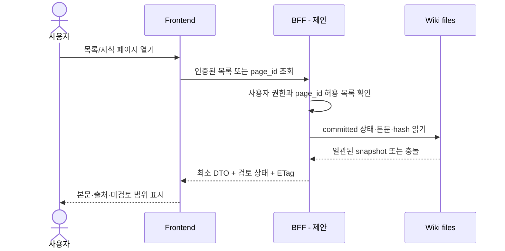
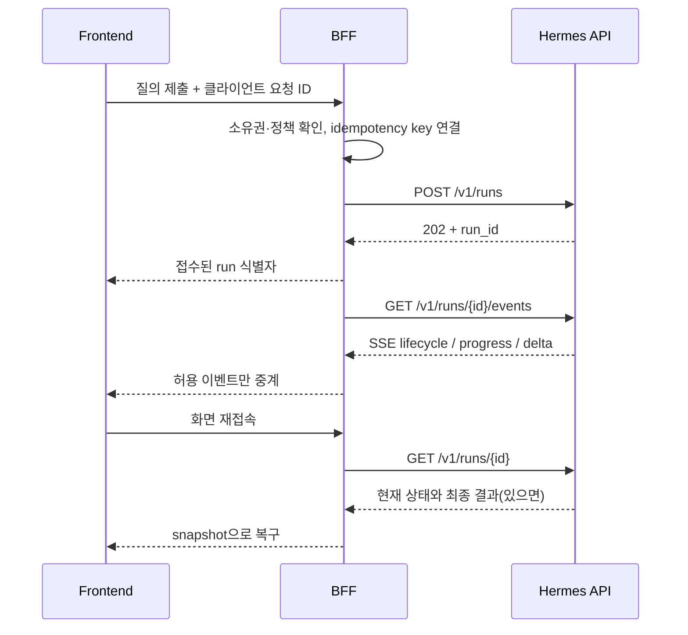

# 워크플로: 탐색부터 질의·승인·게시까지

> 상태: 기존 수집·게시 정책을 보존하는 frontend/BFF 동작 설계.
> [목차](README.md) · [아키텍처](architecture.md) · [API 계약](api-contract.md)

## 1. 탐색 — 모델 없이 읽기



수집 대기와 지식 페이지 미작성은 오류가 아니다. 목록에서 원문 보관 여부와 분석 상태를 각각 표시한다. 여러 상태 파일이 갱신 중이라 snapshot을 확정할 수 없으면 “갱신 중, 다시 시도”로 안내하며 일부 파일만 보고 완료로 승격하지 않는다.

## 2. 질의 — BFF가 실행 문맥을 소유

사전 조건: 별도 사용자 승인 아래 질의 backend의 자료·모델·도구·격리 정책을 검증해야 한다. 이번 문서 작성이 모델 실행 승인을 대신하지 않는다.

1. 사용자 세션을 인증하고 개인 Wiki 접근 권한을 확인한다.
2. 브라우저 conversation ID를 서버 소유 Hermes session ID로 매핑한다.
3. 모델/provider/도구/자료 범위는 서버 allowlist로 결정한다. 클라이언트의 임의 system prompt나 경로는 그대로 승격하지 않는다.
4. 선택한 지식 문서와 질문을 보내고, 신규 원문 읽기·PDF 분석·게시 요청이면 별도 정책 경로로 차단한다.
5. Runs API로 접수한 뒤 run ID를 보관하고, 동일 사용자의 이벤트/상태만 전달한다.
6. 결과에 참조한 Wiki 페이지·revision/hash·실제 읽은 범위를 붙이도록 한다. 미지원 인용을 UI가 만들어내지 않는다.
7. 최종 대답은 대화 결과다. “Wiki에 저장됨” 표시에는 별도 실제 게시 근거가 필요하다.

## 3. 장시간 실행과 스트리밍



- 델타는 표시 중인 임시 텍스트다. 최종 `run.completed`의 결과와 구분한다.
- tool progress, commentary, reasoning, final answer를 하나의 assistant 본문에 무조건 이어 붙이지 않는다.
- SSE comment/keepalive와 named event를 이해하는 parser를 사용한다.
- UTF-8 한 글자·JSON 한 개·SSE 프레임 하나가 여러 HTTP chunk로 나뉠 수 있다.
- 네트워크 단절은 모델 실패나 취소와 다르다. 재연결 시 먼저 상태를 조회한다.
- 이벤트 버퍼는 무한 보관되지 않는다. 설치 버전의 Runs SSE는 단일 queue를 소비하고 연결 종료 시 transport를 삭제하므로 BFF가 upstream을 하나만 구독한다. 전체 과거 이벤트 replay 또는 `Last-Event-ID` 복구를 가정하지 않고, 연결을 잃으면 polling으로 현재/최종 상태를 복구한다.
- 새로고침할 때 새 run을 자동 생성하지 않는다. 재접속과 재실행 버튼을 분리한다.

## 4. 요청 재시도와 중복 방지

`POST /v1/runs`의 `Idempotency-Key`는 같은 요청의 전송 재시도에 쓴다. 동일 key/동일 body는 기존 run을 다시 찾는 의미이며, 수정된 질문의 재생성에는 새 key가 필요하다.

공식 Runs 계약은 key의 durable 보관을 명시하지만, 다른 endpoint에도 같은 계약이 적용된다고 확장하지 않는다. 문서 CORS 절의 캐시 설명과 Runs의 보존 설명도 혼동하지 않는다. 설치 코드 및 live 계약의 차이는 [근거](evidence.md)에 정리한다.

BFF는 `(인증 주체, 대화, 클라이언트 요청 ID)`를 자신이 만든 key/run과 연결한다. 외부 사용자가 다른 사용자의 key를 재사용하거나 guessed run ID를 조회하도록 허용하지 않는다. 429/timeout에서 재시도 여부를 정할 때 작업 생성 성공 여부를 먼저 확인한다.

## 5. 중지

1. 사용자가 중지를 요청하면 BFF가 run 소유권을 확인한다.
2. `POST /v1/runs/{id}/stop`을 호출한다.
3. 응답의 `stopping`은 요청 접수다. 즉시 “완전히 중지됨”으로 표시하지 않는다.
4. 상태/종료 이벤트를 확인해 `cancelled`, 실패 또는 완료 경합을 반영한다.
5. 이미 실행된 파일·외부 도구 효과는 stop으로 rollback되지 않는다.

`AbortController.abort()`로 브라우저 연결을 닫는 것은 위 절차와 다르다. 전송 취소와 에이전트 중지를 구분한다. Gateway 재시작 후 interrupted 상태는 성공으로 재해석하지 않는다.

## 6. 승인 UX와 정책 승인

두 승인 계층은 서로 대체할 수 없다.

| 승인 | 목적 | 제공자 |
| --- | --- | --- |
| Hermes tool approval | 특정 위험한 도구 동작의 허용/거부 | Gateway 런타임 승인 경로 |
| Wiki 단계·자료·게시 승인 | 특정 논문/정책/hash/model/run에 대한 처리 권한 | 정식 Wiki 운영 계약·사용자 |

일반 사용자 UI에는 기본적으로 쓰기 도구를 열지 않는다. 관리 승인 UI를 별도로 만들 경우 실제 pending request의 ID·설명·만료·허용 선택지를 표시하고, 서버가 owner와 pending 상태를 재확인한 뒤 `/approval`로 전달한다. stale approval의 재사용이나 `always` 자동 선택은 금지한다.

승인 카드가 사라진 것을 승인 성공으로 추론하지 않는다. 거부·만료·다른 화면에서 처리·연결 단절을 구분한다. 전체 대화나 비밀값을 승인 로그에 저장하지 않는다.

## 7. 기존 수집 경로 — 변경 없음

기존 Cron `4cff5b4f10ec`는 승인 검색식, KST 일일 한도, 중복·버전 검사에 따라 HTML 원본을 먼저 저장한다. 공식 HTML 미제공이 확인된 경우만 같은 버전 PDF 원본을 보관한다.

403/429/5xx/timeout은 HTML 미제공이 아니다. 수집 후 frontend 목록이 갱신될 수 있지만 그 사건은 컴파일 trigger가 아니다. 이미 PDF로 보관된 버전에 HTML을 자동 추가하지 않는다.

## 8. 지식 컴파일·게시 — 실행되지 않은 향후 연결

정식 순서:

```text
단계/입력/모델/자료 승인
  → 원본·정책·출력 snapshot 고정
  → 승인 HTML 직접 읽기 / v3 별도 승인 PDF 내장 텍스트만 메모리에서 읽기
  → 주장·인용·미독 범위 검토
  → 게시·편집 중지 승인
  → 수집 우선 시간 / 공유 collection.lock 확인
  → 최종 hash 비교 / write-ahead journal
  → 지식·색인·로그·receipt·상태의 조건부 게시
  → committed + 실제 파일 검증
  → frontend 캐시 무효화
```

정확한 쓰기 순서·복구는 기존 publisher 계약과 해당 run journal을 따른다. 다중 파일 transaction이 OS 수준에서 한 번에 원자적으로 보인다고 주장하지 않는다.

현재 P3 일일 전체 경로는 미승인·미검증이다. no_cost_cap이므로 비용 미관측을 이유로 막지 않지만, 단계 승인·무결성·모델 고정·유한 재시도·동시성 조건은 유지한다. 자세한 기준은 [P3 준비 문서](../../../_meta/P3-PREPARATION.md)에 있다.
